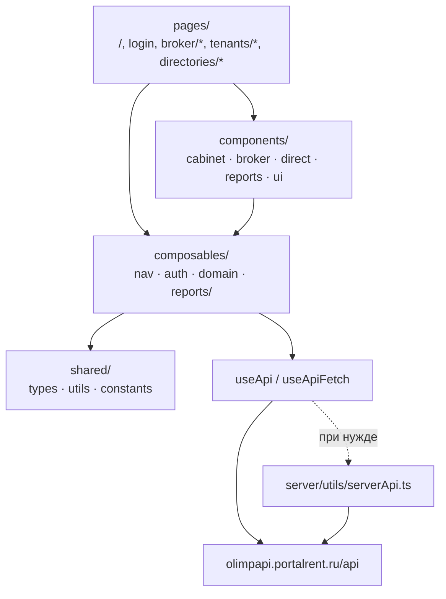

# Архитектура ЛК брокера

SPA на **Nuxt 4** (`ssr: false`, `srcDir: app/`). Бизнес-логика — в composables и `shared/utils`; UI — Vue SFC; данные — внешний Broker API.

Таблица маршрутов разделов — в [README](../README.md#разделы-лк) (единый источник истины).

---

## Слои

| Слой            | Путь                                 | Ответственность                                                 |
| --------------- | ------------------------------------ | --------------------------------------------------------------- |
| Pages / layouts | `app/pages/`, `app/layouts/`         | Маршруты, shell (`default`, `auth`)                             |
| Components      | `app/components/`                    | UI разделов + UI Kit (`ui/`)                                    |
| Composables     | `app/composables/`                   | HTTP, auth, nav, domain CRUD                                    |
| Shared          | `shared/types`, `utils`, `constants` | Контракты, normalize/schema/table/validation, моки, `API_PATHS` |
| Server          | `server/utils/serverApi.ts`          | Nitro `$fetch` к тому же API (роутов `server/api/*` пока нет)   |

Паттерн CRUD справочника:

`composables/useX` → `shared/utils/*Normalize` + `*Schema` + `*Validation` + `*Table` → `components/direct/{entity}/`.

---

## HTTP и mock-режим

| Что           | Где                                                       |
| ------------- | --------------------------------------------------------- |
| Base URL      | `runtimeConfig.public.apiBase` ← `NUXT_PUBLIC_API_BASE`   |
| Пути          | `API_PATHS` в `shared/constants/api.ts`                   |
| Клиент        | `useApi()`, `useApiFetch()` — `app/composables/useApi.ts` |
| Конфиг / mock | `useApiConfig()` — пустой `apiBase` → `isMockMode`        |
| Auth token    | `useAuthToken()` — access JWT в storage                   |
| Сервер        | `serverApi(event?)` — `server/utils/serverApi.ts`         |

- **Mock-режим:** пустой `NUXT_PUBLIC_API_BASE` — доменные composables читают `shared/constants/*Mock.ts`, без запросов к бэкенду. Auth при заданном base всё равно ходит на API.
- **Не** задавать `baseURL` вручную в `$fetch` — только через `useApi` / `serverApi`.
- `NUXT_PUBLIC_CONTRACT_ID` — временный заголовок отчётов (legacy), не замена auth.

OpenAPI: [Swagger](https://olimpapi.portalrent.ru/docs/broker#/) · [JSON](https://olimpapi.portalrent.ru/docs/broker.json).

---

## Навигация

| Composable                   | Назначение                   |
| ---------------------------- | ---------------------------- |
| `useCabinetNav`              | Верхний уровень разделов ЛК  |
| `useCabinetBrokerNav`        | Подменю брокера              |
| `useCabinetTenantsNav`       | Подменю арендаторов          |
| `useCabinetDirectoriesNav`   | Подменю справочников         |
| `useCabinetNavSubmenuLayout` | Раскладка подменю            |
| `useCabinetFooter`           | Ссылки футера                |
| `useCabinetSectionBanner`    | Баннер «раздел в разработке» |

Shell: `CabinetSidebar`, `CabinetHeader`, `CabinetNavBar`, `CabinetFooter`.

Middleware: `auth.global.ts` (сессия), `legacy-routes.global.ts` (редиректы старых путей).

---

## Роли (только UI)

Источник: claims access JWT через `useCabinetRole` → `admin` | `user` (fail-closed).

- Навигация и middleware **не** фильтруют по роли.
- Авторизация данных — на стороне API.

Подробнее: [auth.md](./auth.md).

---

## Стек

| Слой      | Технология                                                           |
| --------- | -------------------------------------------------------------------- |
| Frontend  | Nuxt 4.4, Vue 3, TypeScript, SCSS, `@nuxt/ui`                        |
| Рендер    | `ssr: false` (SPA)                                                   |
| Таблицы   | `@tanstack/vue-table`                                                |
| Формы     | `vee-validate` + `zod`                                               |
| Календарь | FullCalendar                                                         |
| Тесты     | Vitest + `@nuxt/test-utils` + happy-dom — [testing.md](./testing.md) |
| PM        | pnpm 11.x, Node 22+                                                  |

---

## Доменные разделы

| Документ                           | О чём                                                         |
| ---------------------------------- | ------------------------------------------------------------- |
| [directories.md](./directories.md) | Справочники (CRUD)                                            |
| [broker.md](./broker.md)           | Календарь, задачи, текущие дела                               |
| [ui-kit.md](./ui-kit.md)           | Компоненты `Ui*`, токены, иконки                              |
| [auth.md](./auth.md)               | JWT / роли                                                    |
| reports.md                         | Отложено — код отчётов без страниц, ждёт продуктового решения |

---

## Ограничения

- Режим рендера — SPA (`ssr: false`).
- ACL по ролям в навигации и middleware нет (см. [auth.md](./auth.md)).
- `server/api/*` пока нет — запросы идут напрямую на внешний API.
- Отчёты (`app/composables/reports/`, `app/components/reports/`) — код без подключённых страниц.
