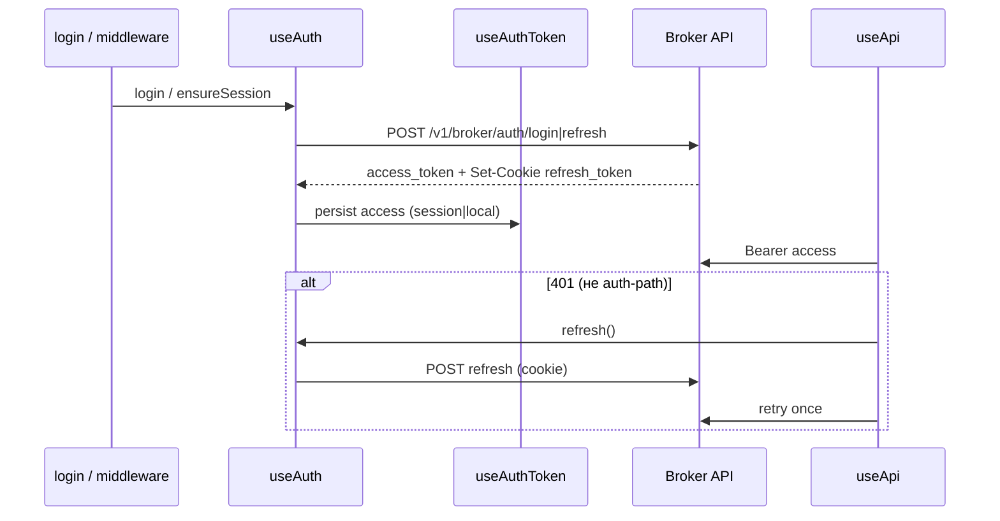

# Авторизация ЛК брокера

Клиентская JWT-сессия в SPA (`ssr: false`) против внешнего Broker API.
Access-токен хранится в браузере; refresh — только в **HttpOnly**-cookie `refresh_token`.

OpenAPI: [Swagger UI](https://olimpapi.portalrent.ru/docs/broker#/) · [JSON](https://olimpapi.portalrent.ru/docs/broker.json)

---

## Модель

| Что                | Где                                 | Как используется                                      |
| ------------------ | ----------------------------------- | ----------------------------------------------------- |
| Access JWT         | `sessionStorage` или `localStorage` | `Authorization: Bearer …`                             |
| Refresh            | HttpOnly cookie `refresh_token`     | `POST …/refresh` с `credentials: 'include'`           |
| Состояние в памяти | Nuxt `useState`                     | `api.accessToken`, `api.remember`, `api.authHydrated` |

- JSON-поле `refresh_token` в ответах login/refresh **игнорируется** (источник истины — cookie).
- Подпись JWT на клиенте **не проверяется** — только decode для UX (срок, роль в шапке).
- Pinia / Nitro BFF-роуты auth / proxy login — **нет**.



---

## Ключевые файлы

| Путь                                             | Назначение                                                       |
| ------------------------------------------------ | ---------------------------------------------------------------- |
| `app/composables/useAuth.ts`                     | `login`, `logout`, `refresh`, `ensureSession`, `redirectToLogin` |
| `app/composables/useAuthToken.ts`                | Persist / hydrate / clear access; cross-tab logout               |
| `app/composables/useApi.ts`                      | Bearer + 401 → refresh → один retry                              |
| `app/composables/useCabinetRole.ts`              | UI-роль из claims access JWT                                     |
| `app/composables/useLoginForm.ts`                | Форма входа (vee-validate + zod)                                 |
| `app/middleware/auth.global.ts`                  | Глобальный guard маршрутов                                       |
| `app/pages/login.vue`                            | Страница входа                                                   |
| `shared/constants/authStorage.ts`                | Ключи storage                                                    |
| `shared/constants/api.ts`                        | `API_PATHS.broker.auth.*`                                        |
| `shared/utils/jwtPayload.ts`                     | Decode / expiry (+ skew 30 с)                                    |
| `shared/utils/cabinetRoleFromJwt.ts`             | Claims → `admin` \| `user`                                       |
| `shared/utils/authCrossTab.ts`                   | Детектор StorageEvent logout                                     |
| `shared/utils/loginSchema.ts` / `loginErrors.ts` | Валидация и сообщения ошибок                                     |

---

## API

База: `runtimeConfig.public.apiBase` ← `NUXT_PUBLIC_API_BASE`
(пустое значение — mock-режим доменных composables; auth всё равно ходит на API, если base задан).

| Операция | Метод и путь                   | Тело / заголовки                 |
| -------- | ------------------------------ | -------------------------------- |
| Login    | `POST /v1/broker/auth/login`   | `{ email, password }`            |
| Refresh  | `POST /v1/broker/auth/refresh` | без body; cookie                 |
| Logout   | `POST /v1/broker/auth/logout`  | `Authorization: Bearer <access>` |

Обёртка успеха: `ApiSuccessResponse<LoginResponse>` →
`{ success, message, payload: { access_token, refresh_token } }`.

Auth-запросы идут через сырой `$fetch` в `useAuth` (**без** 401-retry), чтобы не зациклиться с `useApi`.

---

## Потоки

### Login

1. `useAuth().login({ email, password, remember? })`
2. Persist `access_token` через `useAuthToken.persistTokens`
3. UI: `navigateTo('/', { replace: true })`

### Refresh (silent)

1. Single-flight (`refreshInFlight`)
2. `POST …/refresh` + `credentials: 'include'`
3. Успех → новый access с текущим флагом `remember`
4. Ошибка → `false` **без** очистки токенов (решает вызывающий код)

### ensureSession

1. Hydrate из storage
2. Валидный (не истёкший) access → `true`
3. Иначе `refresh()`; при неудаче → `clearTokens()`, `false`

### Logout

1. Best-effort `POST …/logout` с Bearer (ошибки только в dev-логе)
2. Всегда `clearTokens()` в `finally`
3. Редирект на `/login` (из UI / `redirectToLogin`)

---

## Storage и «Запомнить меня»

Ключи (`AUTH_STORAGE_KEYS`):

| Ключ              | Назначение                              |
| ----------------- | --------------------------------------- |
| `lk.accessToken`  | Access JWT                              |
| `lk.remember`     | `'1'` → читать access из `localStorage` |
| `lk.refreshToken` | **deprecated**; только purge, не писать |

- `remember: true` → access + `lk.remember` в **localStorage**; sessionStorage очищается.
- `remember: false` → access в **sessionStorage**; localStorage auth-ключи очищаются.
- При hydrate удаляется legacy `lk.refreshToken` из обоих storage.

**Cross-tab:** событие `storage` только для **localStorage** (очистка auth-ключа или `clear()`) → сброс in-memory сессии и `redirectToLogin()`. Вкладки с sessionStorage между собой не синхронизируются.

---

## Middleware (`auth.global.ts`)

На **все** маршруты:

1. `hydrateFromStorage()`
2. `ensureSession()`, если есть access **или** remember **или** путь ≠ `/login`
   (чистый аноним на `/login` — без лишнего refresh/419)
3. Не авторизован и не `/login` → `/login`
4. Авторизован и на `/login` → `/`

ACL по ролям **нет** — только «гость / сессия».

---

## HTTP-клиент и 401

`useApi()` / `useApiFetch()`:

1. На каждый запрос: `credentials: 'include'` + Bearer из `accessToken`
2. При **401**:
   - путь содержит `/v1/broker/auth/` → **без** refresh, проброс ошибки
   - иначе `refresh()` → один повтор исходного запроса
   - refresh неудачен → `clearTokens()` + `redirectToLogin()` + ошибка

---

## Роли (только UI)

Источник: claims access JWT (`role_id`, `role`, `full_name`, `sub`) через `mapCabinetRoleFromJwtClaims`.

- `admin` — `role_id === 2` **или** в названии роли есть `руководитель` / `администратор` / `admin`
- иначе `user` (fail-closed)

`useCabinetRole()` → `role`, `roleLabel`, `fullName`, `isAdmin` (бейдж в `CabinetHeader`).
Навигация и middleware **не** фильтруют по роли. Авторизация данных — на стороне API.

---

## Окружение

| Переменная                | Runtime             | Назначение                                   |
| ------------------------- | ------------------- | -------------------------------------------- |
| `NUXT_PUBLIC_API_BASE`    | `public.apiBase`    | Base URL API                                 |
| `NUXT_PUBLIC_CONTRACT_ID` | `public.contractId` | Временный заголовок отчётов (не замена auth) |

См. `.env.example`.

---

## Тесты

```bash
pnpm test                 # unit + nuxt
pnpm test -- --project unit
pnpm test -- --project nuxt
```

| Область     | Файлы                                                                                              |
| ----------- | -------------------------------------------------------------------------------------------------- |
| Unit utils  | `test/unit/jwtPayload.test.ts`, `cabinetRoleFromJwt`, `loginSchema`, `loginErrors`, `authCrossTab` |
| Composables | `test/nuxt/useAuth.test.ts`, `useAuthToken.test.ts`, `useApi.test.ts`                              |
| Helpers     | `test/helpers/jwt.ts`, `authApi.ts`, `test/nuxt/resetAuthClientState.ts`                           |

Конфиг: `vitest.config.ts`.

---

## Ограничения (осознанно)

- Нет проверки подписи JWT на клиенте
- Нет route/nav ACL по ролям
- Нет серверных auth-роутов Nitro
- CSRF-токен в клиенте не реализован (cookie + CORS `credentials`)
- `server/utils/serverApi.ts` пока без привязки к клиентской сессии
