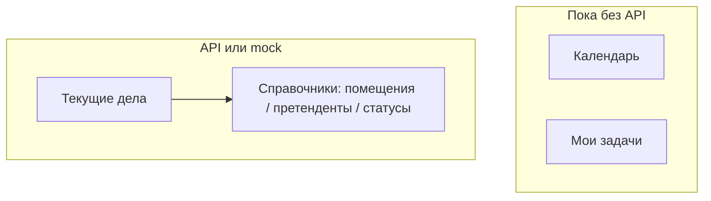

# Брокер

Раздел **Брокер** — повседневная работа: календарь событий, доска задач и **текущие дела** по переговорам с арендаторами.

Для менеджера:

| Подраздел    | Для пользователя сейчас                  | Важно                                                                       |
| ------------ | ---------------------------------------- | --------------------------------------------------------------------------- |
| Календарь    | UI есть, события можно создавать/двигать | данные **только в браузере** (после обновления страницы сброс); **API нет** |
| Мои задачи   | канбан с колонками и приоритетами        | тоже **только локальный mock**; **API нет**                                 |
| Текущие дела | таблица + карточка дела, полный CRUD     | **подключено к API** (или mock без `NUXT_PUBLIC_API_BASE`)                  |

OpenAPI (дела): [Swagger](https://olimpapi.portalrent.ru/docs/broker#/) · [JSON](https://olimpapi.portalrent.ru/docs/broker.json)
См. также: [architecture.md](./architecture.md), [directories/](./directories/) (справочники, которые подставляются в формы дел).

---

## Модель

| Что          | Где                                             | Как используется                           |
| ------------ | ----------------------------------------------- | ------------------------------------------ |
| Меню брокера | `useCabinetBrokerNav`                           | Календарь / Мои задачи / Текущие дела      |
| Календарь    | страница + локальный `ref` событий              | FullCalendar + модалка; без composable API |
| Задачи       | страница + локальный `ref` задач                | канбан (`vue-draggable-plus`); без API     |
| Дела         | `useTenantCases`                                | list / get / create / update / delete      |
| Форма дела   | `useTenantCaseForm`, `useTenantCaseFormOptions` | карточка + опции из справочников           |
| Mock дел     | `tenantCasesMock.ts`                            | при пустом `apiBase`                       |

---

## Ключевые файлы

| Путь                                            | Назначение                                      |
| ----------------------------------------------- | ----------------------------------------------- |
| `app/composables/useCabinetBrokerNav.ts`        | подменю брокера                                 |
| `app/pages/broker/index.vue`                    | redirect → `/broker/calendar`                   |
| `app/pages/broker/calendar.vue`                 | календарь (локальные события)                   |
| `app/pages/broker/tasks.vue`                    | задачи (локальный канбан)                       |
| `app/pages/broker/current/index.vue`            | список дел                                      |
| `app/pages/broker/current/[id].vue`             | карточка дела                                   |
| `app/components/broker/CalendarEventList.vue`   | список событий рядом с календарём               |
| `app/components/broker/CalendarEventModal.vue`  | создание / правка события                       |
| `app/components/broker/TasksBoard.vue`          | канбан                                          |
| `app/components/broker/TasksList.vue`           | список задач                                    |
| `app/components/broker/TaskModal.vue`           | модалка задачи                                  |
| `app/components/broker/current/Sec.vue`         | оболочка списка дел                             |
| `app/components/broker/current/Table.vue`       | таблица + поиск / сортировка / пагинация        |
| `app/components/broker/current/CreateModal.vue` | создание дела                                   |
| `app/components/broker/current/CaseTabs.vue`    | вкладки карточки                                |
| `app/composables/useTenantCases.ts`             | CRUD дел                                        |
| `shared/utils/calendarEvents.ts`                | фильтр / поиск событий                          |
| `shared/utils/tasks.ts`                         | статусы, колонки, группировка                   |
| `shared/utils/tenantCases*.ts`                  | normalize / table / query / validation / schema |
| `shared/constants/tenantCasesMock.ts`           | mock-дела                                       |
| `shared/constants/api.ts`                       | `API_PATHS.broker.tenantCases`                  |

---

## API

База: `runtimeConfig.public.apiBase` ← `NUXT_PUBLIC_API_BASE`.

### Текущие дела

| Операция | Метод и путь                               | Тело / query                                                  |
| -------- | ------------------------------------------ | ------------------------------------------------------------- |
| List     | `GET /v1/broker/tenant-cases`              | `page`, `per_page`, `sort`, `direction`, `search?`, `user_id` |
| Show     | `GET /v1/broker/tenant-cases/{id}`         | —                                                             |
| Create   | `POST /v1/broker/tenant-cases`             | `room_id`, `responsible` (ID), претендент, переговоры         |
| Update   | `PUT /v1/broker/tenant-cases/{id}`         | `room_id`, `responsible` (ID), `applicants[]`                 |
| Delete   | `DELETE /v1/broker/tenant-cases/{id}`      | —                                                             |
| Free     | `GET /v1/broker/tenant-cases/responsibles` | `room_id`, опц. `tenant_case_id` (edit)                       |

`user_id` (JWT `sub`): брокер — только дела, где он ответственный; руководитель брокеров — все.

Опции формы дела (в API-режиме):

| Справочник          | Метод и путь                                     |
| ------------------- | ------------------------------------------------ |
| Помещения           | `GET /v1/broker/dict/rooms`                      |
| Претенденты         | `GET /v1/broker/tenant-applicants?per_page=1000` |
| Статусы переговоров | `GET /v1/broker/dict/negotiation-statuses`       |
| Ответственные       | `GET /v1/broker/tenant-cases/responsibles`       |

Пустой `apiBase` → mock CRUD дел из `TENANT_CASES_MOCK_ITEMS`.

### Календарь и задачи

Эндпоинтов в `API_PATHS.broker` **нет**. Данные живут только в состоянии страницы.

---

## Потоки

### Календарь

1. Открытие `/broker/calendar` — FullCalendar (месяц / неделя / день / список), locale `ru`.
2. Создание / правка — модалка; перетаскивание события меняет даты локально.
3. Обновление страницы — события из seed/локального состояния сбрасываются (нет сохранения на сервер).

### Мои задачи

1. Открытие `/broker/tasks` — колонки «К выполнению» / «В работе» / «Готово».
2. Drag между колонками, модалка создания/правки (название, описание, приоритет, срок).
3. Как и календарь — без бэкенда, состояние теряется при reload.

### Текущие дела — список

1. `/broker/current` → `useTenantCases` загружает список (API или mock).
2. Поиск, сортировка, пагинация; клик по строке → `/broker/current/{id}`.
3. Создание — модалка → POST / mock create.

### Текущие дела — карточка

1. Загрузка дела по id; вкладки: **Помещение**, **Претенденты**, **КП**.
2. Сохранение / удаление через composable.
3. Вкладка **КП** — UI-заглушка (реальных данных КП пока нет).

---

## UI и маршруты

| Маршрут               | Компонент / страница              | Статус                     |
| --------------------- | --------------------------------- | -------------------------- |
| `/broker`             | redirect → calendar               | готово                     |
| `/broker/calendar`    | `calendar.vue` + Calendar\*       | UI готов, данные mock-only |
| `/broker/tasks`       | `tasks.vue` + Tasks\* / TaskModal | UI готов, данные mock-only |
| `/broker/current`     | `BrokerCurrentSec`                | готово (API + mock)        |
| `/broker/current/:id` | карточка + CaseTabs               | готово; вкладка КП — stub  |

---

## Ограничения (осознанно)

- Календарь и задачи **не** персистятся и **не** синхронизируются между устройствами — прототип UI до появления API.
- Вкладка «КП» на карточке дела не связана с отдельным контрактом хранения.
- Авторизация данных дел — на стороне API; роли ЛК (`admin` / `user`) навигацию брокера не режут (см. [auth.md](./auth.md)).

---

## Тесты

См. [testing.md](./testing.md).

| Область         | Файлы                                                           |
| --------------- | --------------------------------------------------------------- |
| Календарь utils | `test/unit/shared/utils/calendarEvents.test.ts`                 |
| Задачи utils    | `test/unit/shared/utils/tasks.test.ts`                          |
| Дела utils      | `test/unit/shared/utils/tenantCases.test.ts`                    |
| Дела nuxt       | `test/nuxt/useTenantCases.test.ts`, `useTenantCaseForm.test.ts` |
| Nav             | `test/nuxt/cabinetNav.test.ts`                                  |
