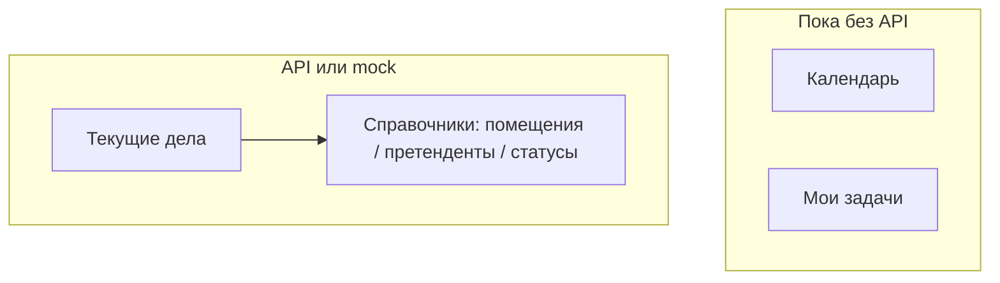

# Брокер

Раздел **Брокер** — повседневная работа: календарь событий, доска задач и **текущие дела** по переговорам с арендаторами.

Для менеджера:

| Подраздел                    | В меню | Для пользователя сейчас                  | Данные                                      |
| ---------------------------- | ------ | ---------------------------------------- | ------------------------------------------- |
| Календарь                    | да     | UI есть, события можно создавать/двигать | **только в браузере**; **API нет**          |
| Мои задачи                   | да     | канбан с колонками и приоритетами        | **только локальный mock**; **API нет**      |
| [Текущие дела](./current.md) | да     | таблица + карточка дела, полный CRUD     | **API** или mock без `NUXT_PUBLIC_API_BASE` |

OpenAPI (дела): [Swagger](https://olimpapi.portalrent.ru/docs/broker#/) · [JSON](https://olimpapi.portalrent.ru/docs/broker.json)
См. также: [architecture.md](../architecture.md), [directories/](../directories/) (справочники в формах дел), [testing.md](../testing.md).

---

## Карта подразделов

| Подраздел                    | Маршрут            | Документ                   | Статус                     |
| ---------------------------- | ------------------ | -------------------------- | -------------------------- |
| Календарь                    | `/broker/calendar` | кратко ниже                | UI готов, данные mock-only |
| Мои задачи                   | `/broker/tasks`    | кратко ниже                | UI готов, данные mock-only |
| [Текущие дела](./current.md) | `/broker/current`  | [current.md](./current.md) | готово (API + mock)        |

Redirect: `/broker` → `/broker/calendar`.

---

## Как устроен раздел (обзор)

| Что           | Где                                             | Как используется                           |
| ------------- | ----------------------------------------------- | ------------------------------------------ |
| Меню брокера  | `useCabinetBrokerNav`                           | Календарь / Мои задачи / Текущие дела      |
| Календарь     | страница + локальный `ref` событий              | FullCalendar + модалка; без composable API |
| Задачи        | страница + локальный `ref` задач                | канбан (`vue-draggable-plus`); без API     |
| Дела          | `useTenantCases`                                | list / get / create / update / delete      |
| Форма дела    | `useTenantCaseForm`, `useTenantCaseFormOptions` | карточка + опции из справочников           |
| Ответственные | `useTenantCaseResponsibles`                     | lazy `GET …/responsibles` по `room_id`     |
| Mock дел      | `tenantCasesMock.ts`                            | при пустом `apiBase`                       |

Паттерн слоя дел (как у справочников):

`composables/useTenantCases*` → `shared/utils/tenantCases*` → `components/broker/current/`.

### Общий контракт API

База: `runtimeConfig.public.apiBase` ← `NUXT_PUBLIC_API_BASE`.
Пути: `API_PATHS.broker.tenantCases` в `shared/constants/api.ts`.

Живой контракт сейчас только у **текущих дел** — детали в [current.md](./current.md).
Календарь и задачи: эндпоинтов в `API_PATHS.broker` **нет**.

Пустой `apiBase` → mock CRUD дел из `TENANT_CASES_MOCK_ITEMS`.

### Общие потоки UI

**Календарь** (`/broker/calendar`):

1. FullCalendar (месяц / неделя / день / список), locale `ru`.
2. Создание / правка — модалка; drag меняет даты локально.
3. Reload страницы — события сбрасываются (нет сервера).

**Мои задачи** (`/broker/tasks`):

1. Колонки «К выполнению» / «В работе» / «Готово».
2. Drag между колонками; модалка (название, описание, приоритет, срок).
3. Без бэкенда — состояние теряется при reload.

**Текущие дела** — см. [current.md](./current.md).

### Ограничения раздела

- Календарь и задачи **не** персистятся и **не** синхронизируются между устройствами — прототип UI до появления API.
- Вкладка «КП» на карточке дела — UI-заглушка (отдельного контракта хранения нет).
- Авторизация данных дел — на стороне API; роли ЛК (`admin` / `user`) навигацию брокера не режут (см. [auth.md](../auth.md)).

### Тесты раздела

См. [testing.md](../testing.md). Специфичные файлы:

| Область             | Файлы                                                                                          |
| ------------------- | ---------------------------------------------------------------------------------------------- |
| Календарь utils     | `test/unit/shared/utils/calendarEvents.test.ts`                                                |
| Задачи utils        | `test/unit/shared/utils/tasks.test.ts`                                                         |
| Дела utils          | `test/unit/shared/utils/tenantCases.test.ts` (+ schema в `directoriesSchema`)                  |
| Дела nuxt           | `useTenantCases`, `useTenantCaseForm`, `useTenantCaseFormOptions`, `useTenantCaseResponsibles` |
| Table UI (контракт) | `test/nuxt/brokerCurrentTable.contract.test.ts`                                                |
| Nav                 | `test/nuxt/cabinetNav.test.ts`                                                                 |
