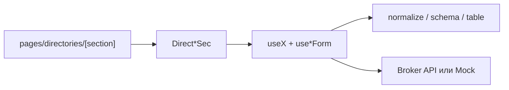

# Справочники

Раздел **Справочники** — общие списки данных, которые брокер и система используют в делах и формах (помещения, типы, категории, юрлица, претенденты, статусы переговоров).

Для менеджера: **6 справочников уже работают** (просмотр, поиск, создание, правка, удаление). **Бренды** и **Договоры** — заглушки («раздел в разработке»), из меню скрыты. Без бэкенда справочники крутятся на локальных mock-данных.

OpenAPI: [Swagger](https://olimpapi.portalrent.ru/docs/broker#/) · [JSON](https://olimpapi.portalrent.ru/docs/broker.json)
См. также: [architecture.md](./architecture.md), [testing.md](./testing.md).

---

## Статус для продукта

| Справочник          | В меню      | Для пользователя      | Данные       |
| ------------------- | ----------- | --------------------- | ------------ |
| Помещения           | да          | полный CRUD           | API или mock |
| Типы помещений      | да          | полный CRUD           | API или mock |
| Категория           | да          | полный CRUD           | API или mock |
| Юр. лица            | да          | полный CRUD           | API или mock |
| Претенденты         | да          | полный CRUD           | API или mock |
| Статусы переговоров | да          | полный CRUD           | API или mock |
| Бренды              | нет (скрыт) | баннер «в разработке» | нет          |
| Договоры            | нет (скрыт) | баннер «в разработке» | нет          |

**CRUD** = список + создание + редактирование + удаление. Удаление — из карточки редактирования, с подтверждением.

---

## Модель

| Что                 | Где                                                  | Как используется                      |
| ------------------- | ---------------------------------------------------- | ------------------------------------- |
| Меню справочников   | `useCabinetDirectoriesNav`                           | 6 видимых пунктов + 2 скрытых stub    |
| Страница секции     | `app/pages/directories/[section].vue`                | монтирует нужный `Direct*Sec` по slug |
| Domain composable   | `app/composables/use*.ts`                            | list / create / update / delete       |
| Form composable     | `use*Form.ts`                                        | vee-validate + zod                    |
| Контракт API        | `shared/utils/*Normalize`, `*Schema`                 | ответ API → модель UI                 |
| Таблица / валидация | `*Table`, `*Validation` (+ `*Query` где server-page) | колонки, фильтр, page                 |
| Mock                | `shared/constants/*Mock.ts`                          | при пустом `NUXT_PUBLIC_API_BASE`     |

Паттерн слоя (один на сущность):

`composables/useX` → `shared/utils/*Normalize` + `*Schema` + `*Validation` + `*Table` → `components/direct/{entity}/`.

---

## Ключевые файлы

| Путь                                                                       | Назначение                                 |
| -------------------------------------------------------------------------- | ------------------------------------------ |
| `app/composables/useCabinetDirectoriesNav.ts`                              | подменю и `hasContent` / `hiddenInSubmenu` |
| `app/pages/directories/index.vue`                                          | редирект на `/directories/premises`        |
| `app/pages/directories/[section].vue`                                      | роутинг по slug → Sec или баннер           |
| `app/composables/usePremises.ts` (+ `usePremiseForm`)                      | помещения                                  |
| `app/composables/useRoomTypes.ts` (+ `useRoomTypeForm`)                    | типы помещений                             |
| `app/composables/useCategories.ts` (+ `useCategoryForm`)                   | категории                                  |
| `app/composables/useLgEntities.ts` (+ `useLegalEntityForm`)                | юр. лица                                   |
| `app/composables/useApplicants.ts` (+ `useApplicantForm`)                  | претенденты                                |
| `app/composables/useNegotiationStatuses.ts` (+ `useNegotiationStatusForm`) | статусы переговоров                        |
| `app/components/direct/{entity}/`                                          | `Sec`, `Table`, `CreateModal`, `EditModal` |
| `shared/constants/api.ts`                                                  | `API_PATHS.broker.*`                       |
| `shared/constants/*Mock.ts`                                                | локальные данные без API                   |
| `shared/constants/sectionUnderDevelopment.ts`                              | текст баннера stub                         |

---

## API

База: `runtimeConfig.public.apiBase` ← `NUXT_PUBLIC_API_BASE`.
Пути: `API_PATHS` в `shared/constants/api.ts`.

Общий контракт для каждой сущности: **GET list**, **POST list**, **PUT detail(id)**, **DELETE detail(id)**.

| Сущность            | List / Create                          | Detail (id)                   | Пагинация                                                       |
| ------------------- | -------------------------------------- | ----------------------------- | --------------------------------------------------------------- |
| Помещения           | `/v1/broker/dict/rooms`                | `/v1/broker/dict/rooms/{id}`  | client-side                                                     |
| Типы помещений      | `/v1/broker/dict/room-types`           | `…/room-types/{id}`           | client-side                                                     |
| Категории           | `/v1/broker/dict/categories`           | `…/categories/{id}`           | client-side                                                     |
| Юр. лица            | `/v1/broker/legal-entities`            | `…/legal-entities/{id}`       | server-side (`page`, `per_page`, `sort`, `direction`, `search`) |
| Претенденты         | `/v1/broker/tenant-applicants`         | `…/tenant-applicants/{id}`    | server-side (те же query)                                       |
| Статусы переговоров | `/v1/broker/dict/negotiation-statuses` | `…/negotiation-statuses/{id}` | client-side                                                     |

Дополнительно:

- Помещения при форме тянут типы: `GET /v1/broker/dict/room-types`.
- Претенденты — категории и юрлица для селектов.

Пустой `apiBase` → **mock-режим**: без HTTP, CRUD на in-memory поверх `*Mock.ts`.
Для brands / contracts путей в `API_PATHS` **нет**.

---

## Потоки

### Список / загрузка

1. Пользователь открывает `/directories/{slug}`.
2. `*Sec` вызывает composable → `fetch` list (API) или mock.
3. Таблица: поиск, сортировка по заголовку, выбор `per_page`, пагинация.
4. Ошибка сети → сообщение + «Повторить».

### Создание / обновление / удаление

1. **Создать** — кнопка в таблице → `CreateModal` → валидация формы → POST → обновление списка.
2. **Редактировать** — клик по строке → `EditModal` → PUT.
3. **Удалить** — только в `EditModal`, двухшаговое подтверждение → DELETE.
4. Ошибки полей с бэка показываются у полей; общая ошибка — отдельно.

---

## UI и маршруты

| Маршрут                             | Компонент / страница           | Статус                   |
| ----------------------------------- | ------------------------------ | ------------------------ |
| `/directories`                      | redirect → premises            | готово                   |
| `/directories/premises`             | `DirectPremisesSec`            | готово                   |
| `/directories/room-types`           | `DirectRoomTypesSec`           | готово                   |
| `/directories/categories`           | `DirectCategoriesSec`          | готово                   |
| `/directories/legal-entities`       | `DirectLgEntitiesSec`          | готово                   |
| `/directories/applicants`           | `DirectApplicantsSec`          | готово                   |
| `/directories/negotiation-statuses` | `DirectNegotiationStatusesSec` | готово                   |
| `/directories/brands`               | баннер                         | заглушка (скрыта в меню) |
| `/directories/contracts`            | баннер                         | заглушка (скрыта в меню) |

---

## Ограничения (осознанно)

- Бренды и договоры не реализованы (нет API-слоя и UI CRUD).
- Нет отдельных Nitro-роутов `server/api/*` — браузер ходит на внешний Broker API.
- Часть справочников — «только название» (категории, типы, статусы); помещения / юрлица / претенденты — более богатые формы.
- Юрлица и претенденты в API-режиме пагинируются на сервере; остальные — на клиенте после полной загрузки списка.

---

## Тесты

См. [testing.md](./testing.md). Специфичные файлы:

| Область                 | Файлы                                                                                           |
| ----------------------- | ----------------------------------------------------------------------------------------------- |
| Normalize / schema      | `test/unit/shared/utils/directoriesNormalize.test.ts`, `directoriesSchema.test.ts`              |
| Table / name validation | `directoriesTable.contract.test.ts`, `directoriesNameValidation.contract.test.ts`               |
| Query (server-page)     | `directoryQuery.contract.test.ts`                                                               |
| Field validation        | `premisesValidation.test.ts`, `legalEntitiesValidation.test.ts`, `applicantsValidation.test.ts` |

Nuxt-тестов composables справочников пока нет.
