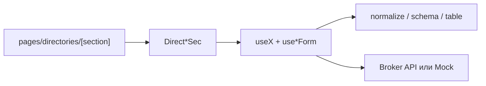

# Справочники

Раздел **Справочники** — общие списки данных, из которых брокер выбирает значения в делах и формах (помещения, типы, категории, юрлица, претенденты, статусы переговоров).

Для менеджера: **6 справочников уже работают** (просмотр, поиск, создание, правка, удаление). **Бренды** и **Договоры** — заглушки («раздел в разработке»), из меню скрыты. Без бэкенда справочники крутятся на локальных mock-данных.

OpenAPI: [Swagger](https://olimpapi.portalrent.ru/docs/broker#/) · [JSON](https://olimpapi.portalrent.ru/docs/broker.json)
См. также: [architecture.md](../architecture.md), [broker.md](../broker.md), [testing.md](../testing.md).

---

## Карта справочников

| Справочник                                       | В меню      | Для пользователя      | Данные       |
| ------------------------------------------------ | ----------- | --------------------- | ------------ |
| [Помещения](./premises.md)                       | да          | полный CRUD           | API или mock |
| [Типы помещений](./room-types.md)                | да          | полный CRUD           | API или mock |
| [Категория](./categories.md)                     | да          | полный CRUD           | API или mock |
| [Юр. лица](./legal-entities.md)                  | да          | полный CRUD           | API или mock |
| [Претенденты](./applicants.md)                   | да          | полный CRUD           | API или mock |
| [Статусы переговоров](./negotiation-statuses.md) | да          | полный CRUD           | API или mock |
| [Бренды](./brands.md)                            | нет (скрыт) | баннер «в разработке» | нет          |
| [Договоры](./contracts.md)                       | нет (скрыт) | баннер «в разработке» | нет          |

**CRUD** = список + создание + редактирование + удаление. Удаление — из карточки редактирования, с подтверждением.

---

## Как устроен раздел (обзор)

| Что                 | Где                                                  | Как используется                      |
| ------------------- | ---------------------------------------------------- | ------------------------------------- |
| Меню справочников   | `useCabinetDirectoriesNav`                           | 6 видимых пунктов + 2 скрытых stub    |
| Страница секции     | `app/pages/directories/[section].vue`                | монтирует нужный `Direct*Sec` по slug |
| Domain composable   | `app/composables/use*.ts`                            | list / create / update / delete       |
| Form composable     | `use*Form.ts`                                        | vee-validate + zod                    |
| Контракт API        | `shared/utils/*Normalize`, `*Schema`                 | ответ API → модель UI                 |
| Таблица / валидация | `*Table`, `*Validation` (+ `*Query` где server-page) | колонки, фильтр, page                 |
| Mock                | `shared/constants/*Mock.ts`                          | при пустом `NUXT_PUBLIC_API_BASE`     |

Паттерн слоя (один на сущность):

`composables/useX` → `shared/utils/*Normalize` + `*Schema` + `*Validation` + `*Table` → `components/direct/{entity}/`.

### Общий контракт API

База: `runtimeConfig.public.apiBase` ← `NUXT_PUBLIC_API_BASE`.
Пути: `API_PATHS` в `shared/constants/api.ts`.

Для каждой живой сущности: **GET list**, **POST list**, **PUT detail(id)**, **DELETE detail(id)**.

| Сущность            | List / Create                          | Detail (id)                   | Пагинация                                                       |
| ------------------- | -------------------------------------- | ----------------------------- | --------------------------------------------------------------- |
| Помещения           | `/v1/broker/dict/rooms`                | `/v1/broker/dict/rooms/{id}`  | client-side                                                     |
| Типы помещений      | `/v1/broker/dict/room-types`           | `…/room-types/{id}`           | client-side                                                     |
| Категории           | `/v1/broker/dict/categories`           | `…/categories/{id}`           | client-side                                                     |
| Юр. лица            | `/v1/broker/legal-entities`            | `…/legal-entities/{id}`       | server-side (`page`, `per_page`, `sort`, `direction`, `search`) |
| Претенденты         | `/v1/broker/tenant-applicants`         | `…/tenant-applicants/{id}`    | server-side (те же query)                                       |
| Статусы переговоров | `/v1/broker/dict/negotiation-statuses` | `…/negotiation-statuses/{id}` | client-side                                                     |

Пустой `apiBase` → **mock-режим**: без HTTP, CRUD на in-memory поверх `*Mock.ts`.
Для brands / contracts путей в `API_PATHS` **нет**.

### Общие потоки UI

1. Пользователь открывает `/directories/{slug}`.
2. Таблица: поиск, сортировка, выбор `per_page`, пагинация.
3. **Создать** → модалка → POST → обновление списка.
4. **Редактировать** → клик по строке → PUT.
5. **Удалить** — только в карточке редактирования, с подтверждением → DELETE.

### Ограничения раздела

- Бренды и договоры не реализованы (нет API-слоя и UI CRUD).
- Нет отдельных Nitro-роутов `server/api/*` — браузер ходит на внешний Broker API.
- Часть справочников — «только название» (категории, типы, статусы); помещения / юрлица / претенденты — более богатые формы.
- Юрлица и претенденты в API-режиме пагинируются на сервере; остальные — на клиенте после полной загрузки списка.

### Тесты раздела

См. [testing.md](../testing.md). Специфичные файлы:

| Область                 | Файлы                                                                                           |
| ----------------------- | ----------------------------------------------------------------------------------------------- |
| Normalize / schema      | `test/unit/shared/utils/directoriesNormalize.test.ts`, `directoriesSchema.test.ts`              |
| Table / name validation | `directoriesTable.contract.test.ts`, `directoriesNameValidation.contract.test.ts`               |
| Query (server-page)     | `directoryQuery.contract.test.ts`                                                               |
| Field validation        | `premisesValidation.test.ts`, `legalEntitiesValidation.test.ts`, `applicantsValidation.test.ts` |
| Domain composables      | `test/nuxt/directories.contract.test.ts`, `directoryForms.contract.test.ts`                     |
| Table UI (контракт)     | `test/nuxt/categoriesTable.contract.test.ts` (+ `ReportsTablePagination.test.ts`)               |
