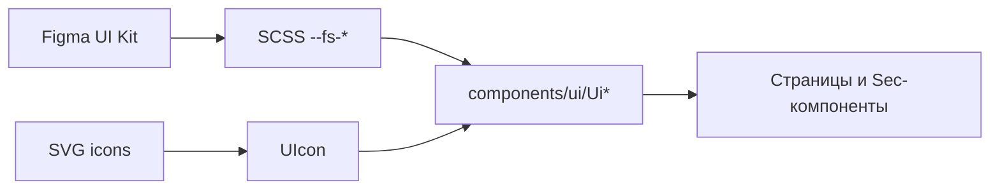

# UI Kit «Олимпийский»

Набор **фирменных элементов интерфейса** ЛК брокера: кнопки, поля ввода, селекты, карточки, баннеры. Нужен, чтобы экраны выглядели одинаково и совпадали с макетами Figma.

Для менеджера: это не отдельный продукт и не страница в меню — **строительный набор** для всех разделов ЛК. Бизнес-логики в `Ui*` нет: только внешний вид и поведение контролов. Источник токенов (цвета, отступы, шрифты) — Figma UI Kit СК «Олимпийский».

Figma (токены цвета): [файл Op9IbTgc66eLejvhLqlZAF](https://www.figma.com/design/Op9IbTgc66eLejvhLqlZAF/?node-id=413-1457)
См. также: [architecture.md](./architecture.md).

---

## Статус для продукта

| Что                              | Состояние                                                        |
| -------------------------------- | ---------------------------------------------------------------- |
| Компоненты `Ui*`                 | используются в shell ЛК, формах, таблицах, справочниках, брокере |
| Токены `--fs-*` / `--fs-figma-*` | заведены в SCSS из Figma                                         |
| Иконки                           | локальные SVG (`i-local-*`, `i-arrow-*`) через `UIcon`           |
| Storybook                        | нет                                                              |

---

## Модель

| Что                | Где                                                       | Как используется                                                    |
| ------------------ | --------------------------------------------------------- | ------------------------------------------------------------------- |
| Компоненты         | `app/components/ui/Ui*.vue`                               | автоимпорт Nuxt; эталон — `UiButton`                                |
| Токены             | `app/assets/styles/variables/`                            | CSS-переменные `--fs-figma-*`, `--fs-color-*`, `--fs-space-*` …     |
| Шрифты             | `app/assets/styles/base/_fonts.scss`, `app/assets/fonts/` | Gilroy (заголовки), Inter (текст/UI)                                |
| Иконки             | `app/assets/icons/`, `app/assets/icons/arrows/`           | коллекции `i-local-*`, `i-arrow-*`                                  |
| Nuxt UI            | `@nuxt/ui` + `@nuxt/icon`                                 | инфраструктура и `UIcon`; **не** `UButton`/`UInput` как основной UI |
| Точка входа стилей | `app/assets/styles/main.scss`                             | variables → fonts → global → Nuxt UI                                |

---

## Ключевые файлы

| Путь                                           | Назначение                                         |
| ---------------------------------------------- | -------------------------------------------------- |
| `app/components/ui/UiButton.vue`               | кнопка (variants / sizes / loading / icon)         |
| `app/components/ui/UiInput.vue`                | текстовое поле                                     |
| `app/components/ui/UiPhoneInput.vue`           | телефон `+7` с маской                              |
| `app/components/ui/UiDateInput.vue`            | дата                                               |
| `app/components/ui/UiSelect.vue`               | одиночный выбор                                    |
| `app/components/ui/UiMultiSelect.vue`          | множественный выбор                                |
| `app/components/ui/UiCombobox.vue`             | выбор или свой текст                               |
| `app/components/ui/UiNavButton.vue`            | пункт навигации (не `UiButton`)                    |
| `app/components/ui/UiConfirmPopup.vue`         | подтверждение действия                             |
| `app/components/ui/UiDocumentCard.vue`         | карточка документа (upload/download)               |
| `app/components/ui/UiEmployeePassCard.vue`     | карточка пропуска сотрудника                       |
| `app/components/ui/UiNewsCard.vue`             | карточка новости / события                         |
| `app/components/ui/UiPromoBanner.vue`          | баннер («раздел в разработке» и др.)               |
| `app/assets/styles/variables/_colors.scss`     | цвета Figma → CSS vars                             |
| `app/assets/styles/variables/_typography.scss` | типографика                                        |
| `app/assets/styles/variables/_spacing.scss`    | отступы                                            |
| `app/assets/styles/variables/_rounding.scss`   | скругления                                         |
| `app/assets/styles/tools/_form-field.scss`     | общие стили полей                                  |
| `app/assets/styles/tools/_ui-kit-card.scss`    | общие стили карточек                               |
| `nuxt.config.ts`                               | `icon.customCollections`, отключение `@nuxt/fonts` |

---

## API

У UI Kit **нет** HTTP API.
Связь с бэкендом — только в доменных composables разделов ([directories](./directories/), [broker](./broker/), [auth](./auth.md)).

---

## Потоки

### Как подключать в экране

1. В шаблоне использовать `UiButton`, `UiInput`, … (автоимпорт).
2. Цвета / отступы брать из `--fs-*`, не хардкодить hex в компонентах разделов без нужды.
3. Иконки — имена коллекций, например `i-local-logo`, `i-arrow-chevron-down` через prop `icon` у `UiButton` или `UIcon`.

### Кнопка (кратко)

- **Variants:** `primary`, `inverse`, `outline`, `soft`, `accent`, `auth`, `success`, `warning`.
- **Sizes:** `md`, `sm`, `chrome`, `arrow`.
- Состояния: `disabled`, `loading`; опционально `fit` / `wrap` для узких колонок (сайдбар).

### Баннер «раздел в разработке»

`UiPromoBanner` + константы из `shared/constants/sectionUnderDevelopment.ts` — для stub-маршрутов (бренды, договоры, арендаторы-заглушки).

---

## UI и маршруты

Отдельного маршрута у UI Kit нет. Компоненты встречаются по всему ЛК:

| Где                | Примеры                                            |
| ------------------ | -------------------------------------------------- |
| Shell              | сайдбар, хедер, футер (`UiNavButton`, иконки)      |
| Auth               | форма входа (`UiInput`, `UiButton` variant `auth`) |
| Справочники / дела | таблицы, модалки, селекты, телефон, дата           |
| Заглушки           | `UiPromoBanner`                                    |

---

## Ограничения (осознанно)

- Продуктовый UI строится на **кастомных `Ui*`**, а не на готовых `UButton` / `UInput` из Nuxt UI.
- `colorMode` выключен — отдельной тёмной темы ЛК нет.
- Часть карточек (`UiNewsCard`, `UiEmployeePassCard`, `UiDocumentCard`) может опережать текущие страницы продукта — задел под будущие экраны.
- Storybook / визуальный каталог в репозитории не ведутся.

---

## Тесты

См. [testing.md](./testing.md). Не гоняем все `Ui*` — только контролы с логикой (`mountSuspended` + `@vue/test-utils`, хелпер `test/helpers/mountUi.ts`).

| Область            | Файлы                                                                                |
| ------------------ | ------------------------------------------------------------------------------------ |
| Select / Combobox  | `test/nuxt/UiSelect.test.ts`, `UiCombobox.test.ts`, `UiMultiSelect.test.ts`          |
| Phone / Date       | `test/nuxt/UiPhoneInput.test.ts`, `UiDateInput.test.ts`                              |
| Косвенно (таблицы) | `categoriesTable.contract`, `ReportsTablePagination` — эмиты toolbar/sort/pagination |
